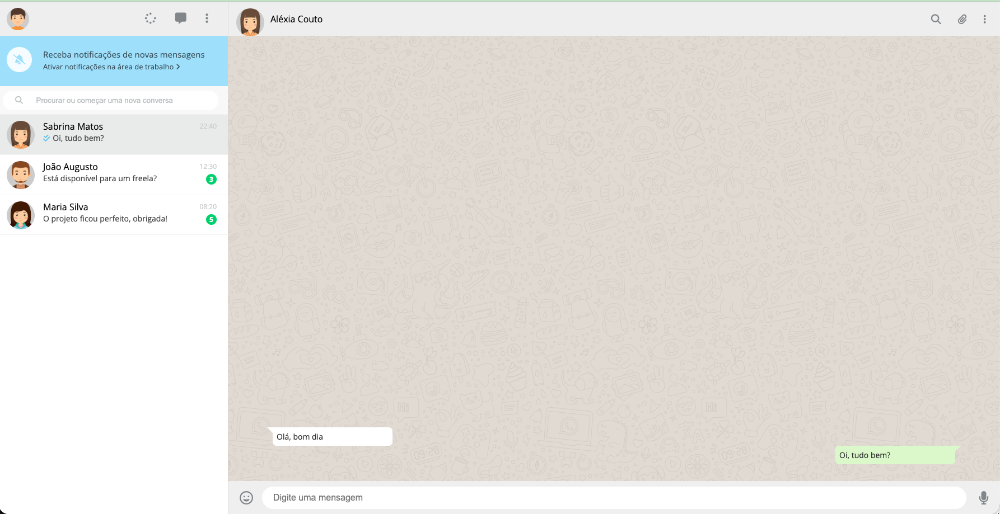

# WhatsApp Web Clone

A CSS practice project — recreating the WhatsApp Web interface using only HTML5 and CSS3, with no frameworks or JavaScript. The goal was to study layout techniques, positioning, custom properties, and pseudo-elements in a real-world UI context.

> **To add the screenshot:** open `index.html` in your browser, take a screenshot, save it as `img/preview.png`, and the image above will appear automatically.

## Features

- Sidebar with contact list, active chat highlight, and unread message badge
- Search bar
- Desktop notification banner
- Chat area with message bubbles (sent and received) with CSS triangle tails
- Bottom bar with emoji, text input, and microphone icons
- Background pattern behind messages

## Built with

- Semantic HTML5 (`<aside>`, `<main>`, `<nav>`)
- CSS custom properties (variables)
- CSS `calc()` for dynamic sizing
- CSS pseudo-elements (`::before`, `::after`) for message bubble tails
- Google Fonts — Open Sans
- Font Awesome 6 icons

## How to run

No build step needed. Just open `index.html` in any browser.
